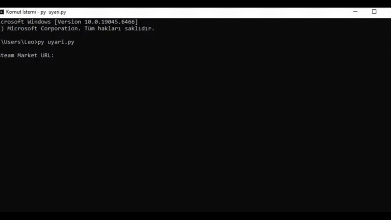
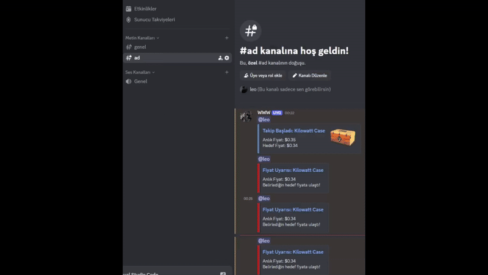

## ✦ Proje Hakkında

> **Steam Market Price Alert Bot**, Steam Community Market üzerindeki ürünleri
> belirlediğiniz fiyat seviyelerine göre izleyen ve hedef fiyat yakalandığında
> **Discord üzerinden otomatik bildirim** gönderen bir Python uygulamasıdır.

Bu proje;
```bash
- Arka planda sessiz çalışır,
- Güncel Chrome sürümleriyle uyumludur,
- Aynı anda birden fazla ürünü takip edebilir.
```
---


## ✦ Öne Çıkan Özellikler

| Özellik | Açıklama |
|------|--------|
| **Fiyat Takibi** | Steam Market fiyatlarını otomatik kontrol |
| **Discord Bildirimi** | Hedef fiyata ulaşınca anlık uyarı |
| **Çoklu Takip** | Aynı anda birden fazla ürün izleme |
| **Headless Chrome** | Tarayıcı açılmadan çalışma |
| **Otomatik Driver** | ChromeDriver manuel kurulum gerekmez |
| **Sessiz Mod** | Chrome logları kapalı |

---

## ✦ Sistem Gereksinimleri

Aşağıdaki gereksinimler sağlandığında uygulama sorunsuz çalışır:

- **Python:** 3.9 veya üzeri  
- **Tarayıcı:** Google Chrome (güncel sürüm)  
- **İşletim Sistemi:** Windows, Linux, macOS  
- **İnternet:** Steam ve Discord erişimi  

---

## ✦ Proje Dizini

```text
steam-market-price-alert/
│
├── uyari.py
├── requirements.txt
├── README.md
├── .gitignore
├── LICENSE
└── screenshots/
    ├── demo.gif
    ├── webhook.gif
```
## ✦ Canlı Demo



---
## ✦ Dosyaları indirin
```bash
git clone https://github.com/leoniofficials/Steam-Fiyat-Takip
```
---
## ✦ Dosyayı açın.
```bash
cd Steam-Fiyat-Takip
```
```bash
explorer . 
```
```bash
uyari.py dosyasını açın.
```
---
## ✦ Kodları Düzenleyin
```bash
WEBHOOK_URL = "DISCORD_HOOK_BURAYA_GIRILECEK"
DISCORD_USER_ID = "DISCORD_USERID_BURAYA_GIRILECEK"
```
--- 
## ✦ WEBHOOK ve DISCORD USER ID Nasıl Alınır?



---
## ✦ Gerekli Dosyaları Yükleyin
```bash
pip install -r requirements.txt
```
## ✦ Kullanım
Uygulamayı başlatmak için şu adımları kullanın:
```bash
python uyari.py
```
```bash
https://steamcommunity.com/market/listings/730/Kilowatt%20Case
```
---

**Takip başlatıldıktan sonra:**

Fiyat düzenli olarak kontrol *edilir*.

Hedef fiyata ulaşıldığında **Discord** bildirimi gönderilir.
## ✦ Yasal Uyarı

**Bu proje eğitim ve kişisel kullanım amaçlıdır.
Steam ve Discord servislerinin kullanım şartlarından kullanıcı sorumludur.**

## ✦ Katkıda Bulunma
Projeye katkıda bulunmak için,

⭐ Projeme Star bırakabilirsiniz.

**developed by:** *leoniofficials*

---
